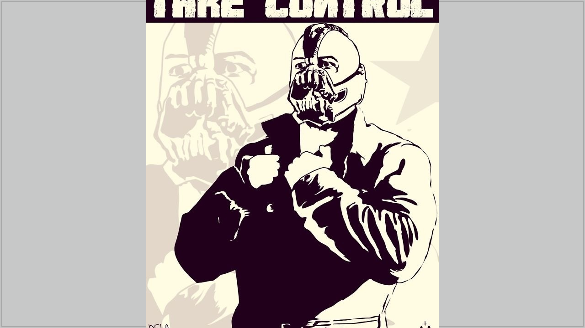
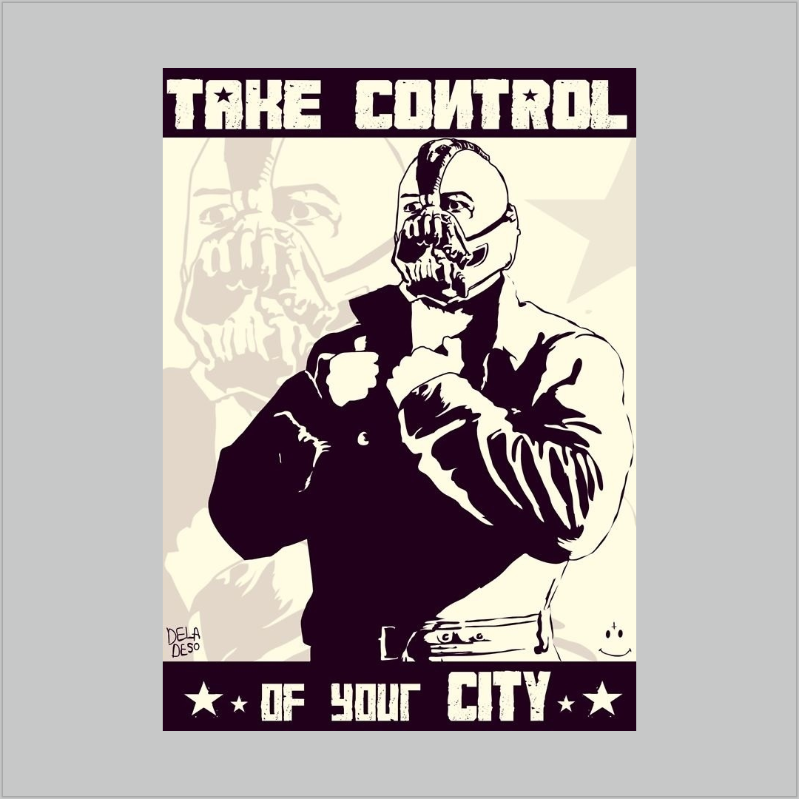
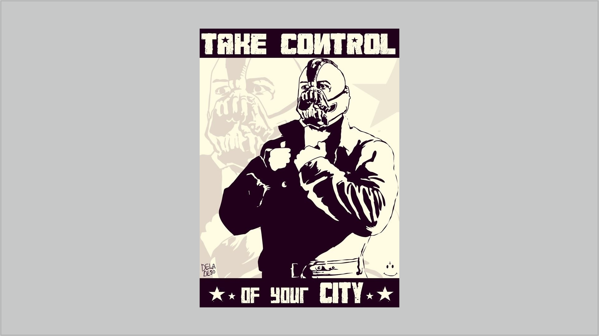

# DemoSwingRatio

This is a demo that try to implement with Java Swing the ratio 16:9 and 16:10, like powerpoint use case.

You can download the jar [here](https://gitlab.com/vincenzopalazzo/demoswingratio/-/tree/master/bin)

## Results

After first the, with Swing is possible redimention to runtime the dimension of *complex* panel, like Mars map in [JMars](http://jmars.mars.asu.edu/)

Attending other test

At the moment the image generate with the demo are:

### 4:9

### 1:1

### 16:9

### Profiler

You can found here the execution profiler [Download]()

# TODO list

- [X] [Create a method to generate the image from a component](https://stackoverflow.com/questions/1349220/convert-jpanel-to-image)
- [X] [Create a method to load personal image inside the JPanel (like pawerpoint)](https://stackoverflow.com/questions/22162398/how-to-set-a-background-picture-in-jpanel)

# Sponsor

If my work was utils also with other developers, you can make a little donation at the following link

or 

[Github donations](https://github.com/sponsors/vincenzopalazzo?preview=true)

 This demo is developed in collaborations with Arizona State University. 

